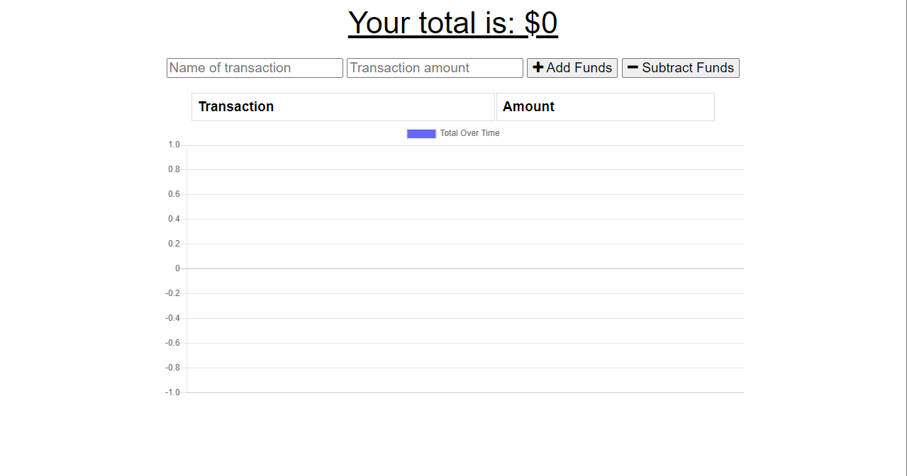

# pwa_budget
This is a budget tracker that has been updated to allow for offline access and functionality. You will be able to add expenses and deposits to your budget with or without a connection! The totals will automatically update once the end user obtains a stable internet connection. 

## Table of Contents

- [User Story](#UserStory)
- [Tutorial](#Tutorial)
- [Built With](#BuiltWith)
- [Author](#Author)
- [License](#license)
- [Aknowledgements](#aknowledgements)

## User Story

AS AN avid traveler
I WANT to be able to track my withdrawals and deposits with or without a data/internet connection
SO THAT my account balance is accurate when I am traveling 

## Tutorial  
  
  * Visit the website [here](https://pure-sierra-01358.herokuapp.com/)  

  

## Built With

* [MongoDB](https://docs.mongodb.com/)
* [Express](https://www.npmjs.com/package/express)
* [Javascript](https://developer.mozilla.org/en-US/docs/Web/JavaScript)
* [HTML]
* [CSS]

## Author

**Alex Running** 

- [Link to Portfolio Site](https://snowslurpie.github.io/alex-portfolio/)
- [Link to Github](https://github.com/SnowSlurpie)

## License

This project is licensed under the MIT License 

## Acknowledgments

* [W3 Schools](https://www.w3schools.com/)
* [MDN Web Docs](https://developer.mozilla.org/en-US/)
* [MongoDB Docs](https://docs.mongodb.com/)
* [Micah Zahn](https://github.com/Mazattack1999) for providing debugging assistance.